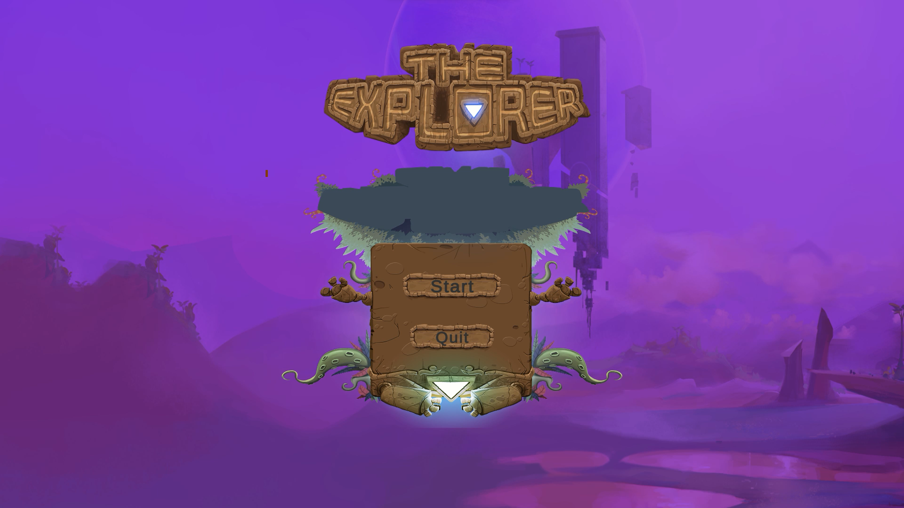
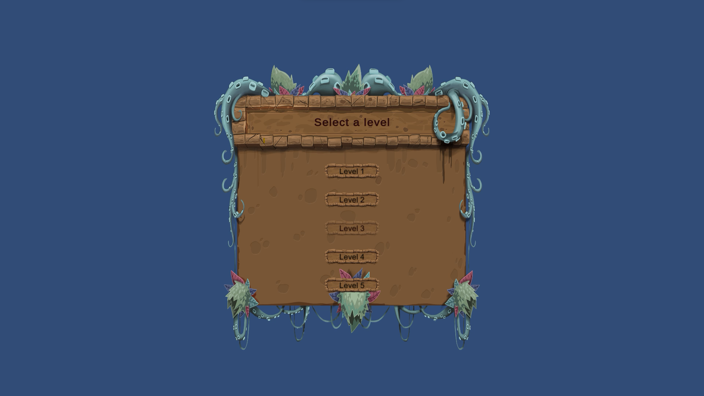
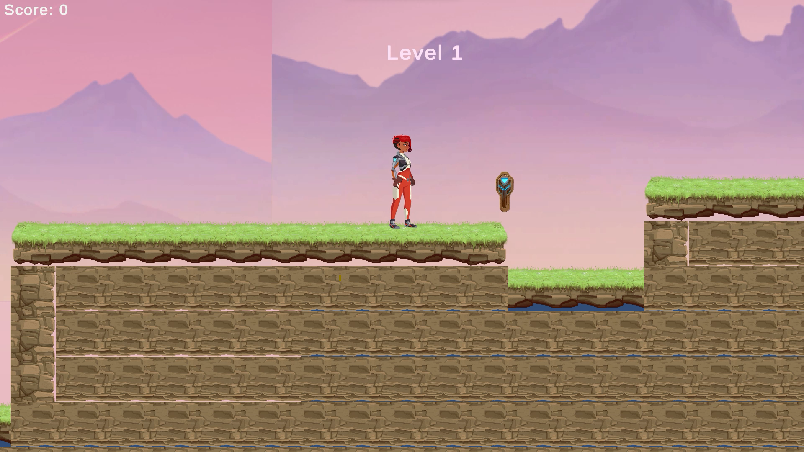
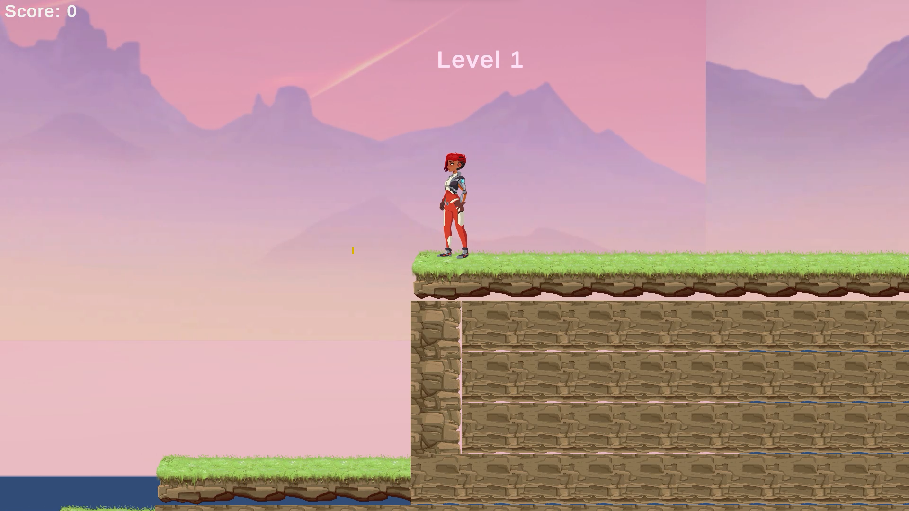
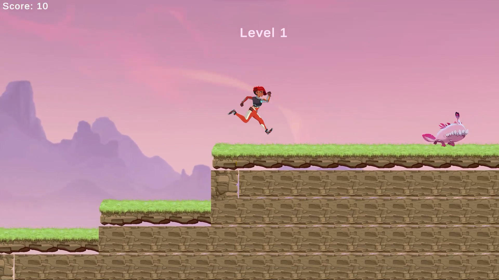
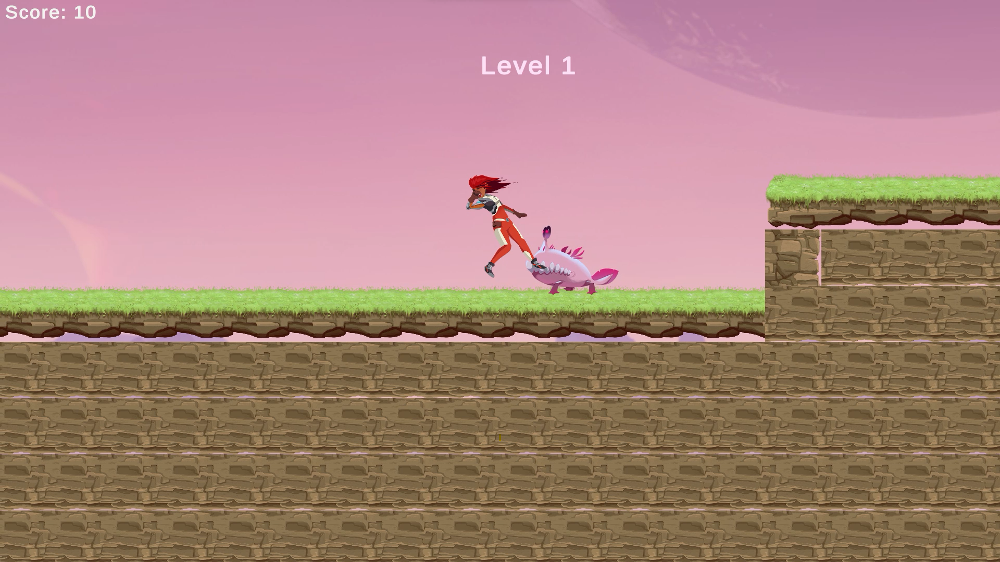
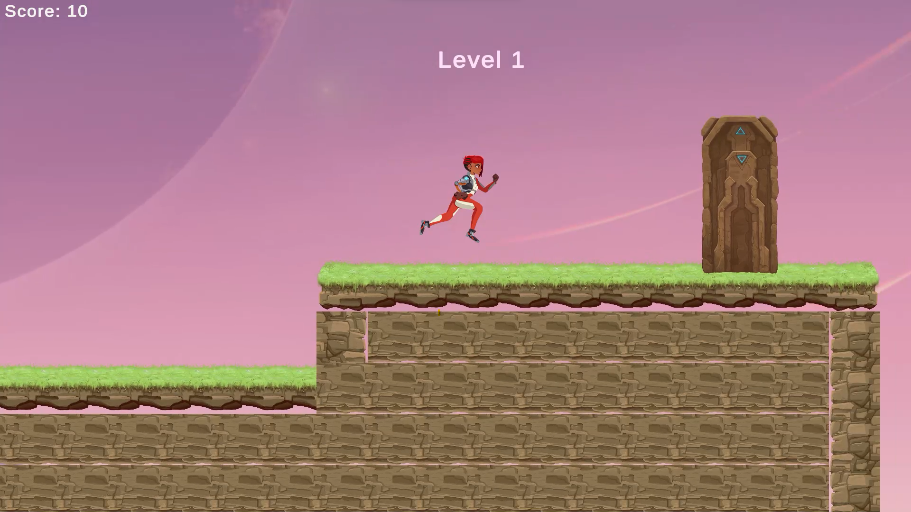

# The Explorer

### Introduction
    Ellen: The Explorer is a 2D platformer game where the player explores the world to find a key that
    unlocks the secret door. The player must be careful of enemies and spike traps while exploring.

    
### Screenshots

   
   
   
   
   
   
   

   
### Implementation and Game Design
#### Implementation
    - Developed a 2D platformer featuring tilemap-based ground and player movement controls. 

    - Implemented a Sound Manager class as singleton to manage sound effects throughout the game. 

    - Implemented a Level Manager class as a singleton for level unlocking system. 

#### Game Design
    - For rapid level design, Unity's Tilemap was utilized, enabling expedited level creation by 
      painting tiles and specifying tilemap rules.
    
### Gameplay Demonstration
    - For a visual demonstration of the gameplay, watch video on YouTube:
 [Youtube video link](https://youtu.be/9cmk1fh45Vs)

 

